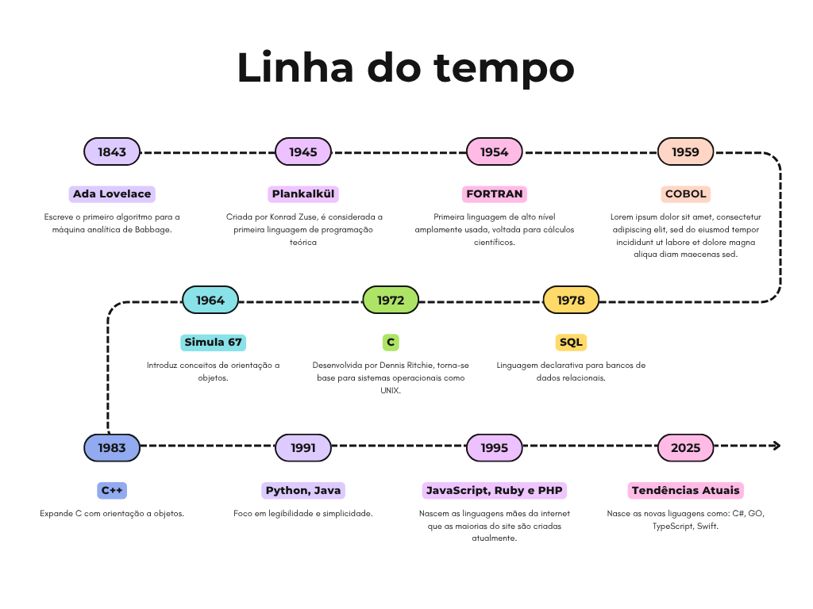

# Linha do Tempo das Linguagens de Programação

## Antes de 1950 – Os Conceitos Iniciais
- **1843 – Ada Lovelace**: Escreve o primeiro algoritmo para a máquina analítica de Babbage. Considerada a primeira programadora da história.
- **1945 – Plankalkül**: Criada por Konrad Zuse, é considerada a primeira linguagem de programação teórica.

## Década de 1950 – Linguagens de Baixo Nível
- **1957 – FORTRAN**: Primeira linguagem de alto nível amplamente usada, voltada para cálculos científicos.
- **1958 – LISP**: Introduz programação funcional e manipulação de listas.
- **1959 – COBOL**: Focada em negócios e processamento de dados comerciais.

## Década de 1960 – Paradigmas Emergentes
- **1964 – BASIC**: Criada para facilitar o ensino de programação.
- **1967 – Simula 67**: Introduz conceitos de orientação a objetos.
- **1969 – B**: Antecessora direta da linguagem C.

## Década de 1970 – Consolidação e Eficiência
- **1972 – C**: Desenvolvida por Dennis Ritchie, torna-se base para sistemas operacionais como UNIX.
- **1972 – Smalltalk**: Populariza a programação orientada a objetos.
- **1978 – SQL**: Linguagem declarativa para bancos de dados relacionais.

## Década de 1980 – Interfaces e Objetos
- **1983 – C++**: Expande C com orientação a objetos.
- **1987 – Perl**: Famosa por manipulação de texto e scripts.
- **1984 – MATLAB**: Voltada para cálculos matemáticos e engenharia.

## Década de 1990 – Web e Portabilidade
- **1991 – Python**: Foco em legibilidade e simplicidade.
- **1995 – Java**: “Escreva uma vez, execute em qualquer lugar” — popular na web e dispositivos móveis.
- **1995 – JavaScript**: Linguagem essencial para interatividade em páginas web.
- **1995 – PHP**: Voltada para desenvolvimento web dinâmico.

## Década de 2000 – Frameworks e Escalabilidade
- **2000 – C#**: Criada pela Microsoft para a plataforma .NET.
- **2009 – Go (Golang)**: Desenvolvida pelo Google, foca em simplicidade e concorrência.
- **2010 – Rust**: Segurança de memória e performance sem coletor de lixo.

## Década de 2010 – Mobile e Modernidade
- **2011 – Kotlin**: Alternativa moderna ao Java para Android.
- **2014 – Swift**: Linguagem da Apple para desenvolvimento iOS/macOS.
- **2015 – TypeScript**: Superset de JavaScript com tipagem estática.

## Futuro e Tendências
- **Linguagens como Dart, Julia e Zig** estão ganhando espaço em nichos como ciência de dados, sistemas embarcados e desenvolvimento multiplataforma.
- **Inteligência Artificial e automação** estão influenciando o surgimento de linguagens mais declarativas e integradas com machine learning.

---