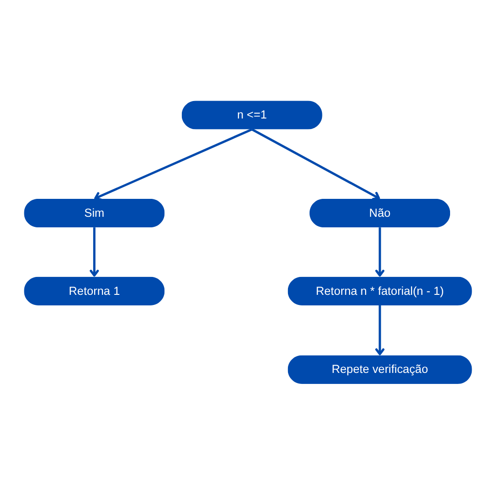

# 07 - Subprogramas

Neste exemplo, demonstramos como funciona a **passagem de parâmetros por valor** e **por referência** em Python, uma linguagem que trata essa distinção de forma bastante clara com base na mutabilidade dos objetos.

- **Passagem por valor**: Ocorre quando o valor de um argumento é copiado para o parâmetro da função. Qualquer alteração feita no parâmetro não afeta a variável original. Em Python, isso acontece com **tipos imutáveis**, como `int`, `float`, `str`, `tuple`, etc.
- **Passagem por referência**: Ocorre quando a função recebe uma referência para o objeto original. Isso significa que alterações feitas dentro da função podem modificar o valor da variável fora dela. Em Python, isso ocorre com **tipos mutáveis**, como `list`, `dict`, `set`, etc.

```python
def por_valor(x):
    x = x + 10
    print(f"Dentro da função (valor): {x}")

def por_referencia(lista):
    lista.append(10)
    print(f"Dentro da função (referência): {lista}")

a = 5
por_valor(a)
print(f"Depois da função (valor): {a}")

b = [1, 2, 3]
por_referencia(b)
print(f"Depois da função (referência): {b}")

```
## Fluxograma:

