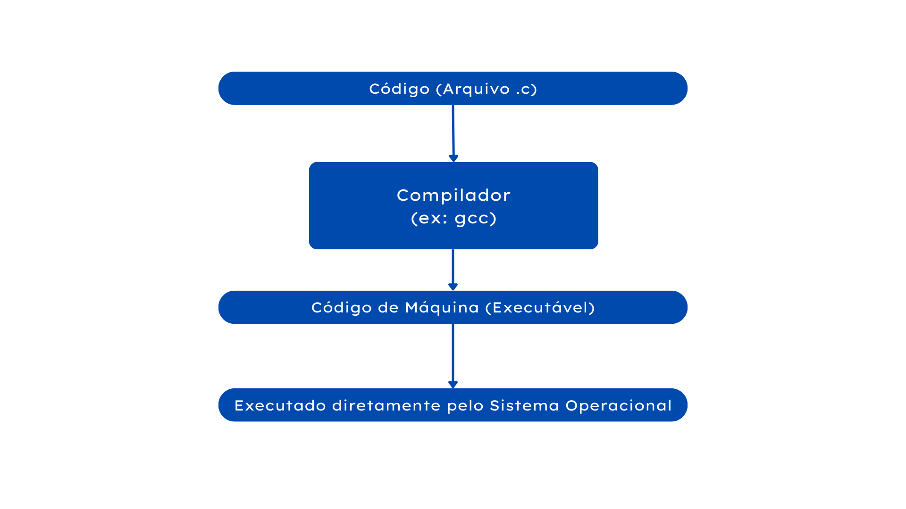

# Ambientes de Programação: Compilador, Interpretador e Máquina Virtual

## O que são?
Quando você escreve um programa, ele está em **linguagem de alto nível** (como C, Python, Java). Mas o computador só entende **linguagem de máquina** (binário).  
A ponte entre esses dois mundos é feita por **três tecnologias principais**:

---

## 1. Compilador

### O que faz?
Um **compilador** lê **todo o código-fonte de uma vez**, verifica erros e o transforma em um **programa executável** (`.exe`, binário, etc).

### Como funciona?
1. Você escreve o código em C, por exemplo.  
2. Executa o compilador (`gcc`, `rustc`, `javac`).  
3. Ele gera um **arquivo binário** que pode ser executado diretamente pelo sistema operacional.

### Vantagens:
- Alta performance (executa rápido)
- Detecção precoce de erros
- Independente da linguagem original após compilado

### Desvantagens:
- Precisa recompilar a cada modificação
- Mais difícil para testes rápidos

### Exemplos:
- C com `gcc`
- Rust com `rustc`
- Pascal com `fpc`

---

## 2. Interpretador

### O que faz?
Um **interpretador** lê e **executa o código linha por linha**, sem gerar um executável.

### Como funciona?
1. Você escreve o código em Python.  
2. O interpretador (`python`, `node`, etc) **lê cada linha e executa imediatamente**.

### Vantagens:
- Ideal para testes rápidos e scripts
- Multiplataforma
- Fácil de depurar

### Desvantagens:
- Execução mais lenta
- Erros podem aparecer só durante execução

### Exemplo:
- Python com `CPython`

---

## 3. Máquina Virtual (VM)

### O que faz?
Uma **máquina virtual** simula um computador dentro de outro.  
Ela executa um **bytecode** que é mais portátil que código de máquina.

### Como funciona?
1. O compilador gera bytecode (ex: `javac` gera `.class`)  
2. A máquina virtual (como JVM) interpreta ou otimiza esse bytecode.  
3. O programa roda em qualquer sistema com uma **VM instalada**.

### Vantagens:
- Portabilidade total
- Segurança e isolamento
- Pode misturar compilação e interpretação

### Desvantagens:
- Pode ter performance inferior a programas nativos
- Depende de uma VM instalada

### Exemplos:
- Java com **JVM**
- C# com **.NET CLR**

---

## Comparação em Tabela

| Tipo           | Tradução            | Execução         | Performance     | Portabilidade | Exemplos              |
|----------------|---------------------|------------------|-----------------|---------------|------------------------|
| **Compilador** | Antes da execução   | Binário          | Alta            | Baixa         | C, Rust, Pascal        |
| **Interpretador** | Durante execução | Linha a linha    | Média/Baixa     | Alta          | Python, JavaScript     |
| **Máquina Virtual** | Bytecode via VM | Virtualizada     | Média           | Muito Alta    | Java, C#               |

---

## Diagrama

